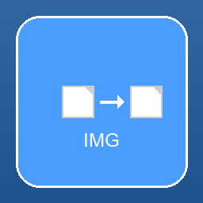

# Image Converter Pro

A modern desktop application for converting image formats with drag-and-drop functionality, built with Python and CustomTkinter.



## Features

### 🖼️ **Core Functionality**
- **Drag & Drop Support**: Simply drag images into the application window
- **Bulk Processing**: Convert multiple files simultaneously 
- **Wide Format Support**: PNG, JPEG, JPG, WebP, TIFF, BMP, GIF, AVIF, and more
- **Smart File Detection**: Automatically detects image formats
- **Progress Tracking**: Real-time progress bar and status updates

### 🎨 **Modern User Interface**
- **Dark/Light Theme**: Toggle between dark and light modes
- **Responsive Design**: Clean, modern interface built with CustomTkinter
- **File List Management**: Add/remove files with individual controls
- **Visual Feedback**: Drag-and-drop highlight effects

### ⚙️ **Advanced Options**
- **Image Resizing**: Resize images while maintaining aspect ratio
- **Quality Control**: Adjust JPEG quality settings (1-100)
- **Output Folder Selection**: Choose custom output directories
- **Batch Processing**: Process multiple images efficiently
- **Error Handling**: Graceful handling of conversion failures

### 🚀 **Performance**
- **Multi-threading**: Non-blocking UI during conversions
- **Memory Efficient**: Optimized for large batches
- **Progress Tracking**: Real-time conversion status
- **Offline Operation**: No internet connection required

## Installation

### Option 1: Run from Source

1. **Clone or download** this repository
2. **Install Python 3.7+** if not already installed
3. **Install dependencies**:
   ```bash
   pip install -r requirements.txt
   ```
4. **Run the application**:
   ```bash
   python main.py
   ```

### Option 2: Build Executable

1. **Follow steps 1-3 from Option 1**
2. **Create the executable**:
   ```bash
   python build_exe.py
   ```
3. **Find the executable** in the `dist/` folder

## Requirements

### System Requirements
- **Operating System**: Windows 10/11, macOS 10.14+, or Linux
- **Python**: 3.7 or higher (if running from source)
- **Memory**: 512MB RAM minimum, 1GB recommended
- **Storage**: 50MB free space

### Python Dependencies
```
customtkinter==5.2.0
Pillow==10.0.1
tkinterdnd2==0.3.0
opencv-python==4.8.1.78
imageio==2.31.5
pyinstaller==6.1.0
```

## Usage Guide

### Basic Usage

1. **Launch** the application
2. **Add images** by:
   - Dragging and dropping files into the drop zone
   - Clicking the drop zone to browse for files
3. **Select output format** from the dropdown (PNG, JPEG, WebP, etc.)
4. **Choose output folder** (optional - defaults to same as input)
5. **Click "Start Conversion"** to begin processing

### Advanced Features

#### Image Resizing
1. Check "Resize Images" in the settings panel
2. Enter desired width and height
3. Images will be resized maintaining aspect ratio

#### Quality Settings
1. Check "Custom Quality" for JPEG output
2. Adjust quality slider (1-100, higher = better quality)
3. Only applies to JPEG/JPG output formats

#### Output Management
- **Same as Input**: Saves converted files next to originals
- **Custom Folder**: Choose a specific output directory
- **Auto-naming**: Prevents overwriting existing files

## Supported Formats

### Input Formats
- **JPEG/JPG**: Joint Photographic Experts Group
- **PNG**: Portable Network Graphics
- **WebP**: Google's modern image format
- **TIFF/TIF**: Tagged Image File Format
- **BMP**: Windows Bitmap
- **GIF**: Graphics Interchange Format
- **AVIF**: AV1 Image File Format
- **ICO**: Windows Icon format
- **PPM/PGM/PBM**: Netpbm formats

### Output Formats
- **PNG**: Best for images with transparency
- **JPEG/JPG**: Best for photographs
- **WebP**: Modern format with excellent compression
- **TIFF**: Best for high-quality archival
- **BMP**: Uncompressed bitmap format
- **GIF**: Supports animation and transparency
- **ICO**: Windows icons

## File Structure

```
ImageConverter/
├── main.py                 # Main application file
├── image_converter.py      # Core conversion engine
├── utils.py               # Utility classes and functions
├── advanced_features.py   # Advanced features (preview, batch options)
├── create_icon.py         # Icon creation script
├── build_exe.py          # Executable build script
├── requirements.txt       # Python dependencies
├── app_icon.ico          # Application icon
├── app_icon.png          # Application icon (PNG)
└── README.md             # This file
```

## Troubleshooting

### Common Issues

**Application won't start:**
- Ensure all dependencies are installed: `pip install -r requirements.txt`
- Check Python version: `python --version` (requires 3.7+)

**Conversion fails:**
- Check if input file is a valid image
- Ensure output folder has write permissions
- Verify sufficient disk space

**Drag and drop not working:**
- Try clicking the drop zone to browse for files instead
- Ensure tkinterdnd2 is properly installed

**Interface looks wrong:**
- Try switching between dark/light themes
- Restart the application
- Update CustomTkinter: `pip install --upgrade customtkinter`

### Performance Tips

- **Large batches**: Process in smaller groups for better responsiveness
- **High-resolution images**: Consider resizing for faster processing
- **Output formats**: Choose appropriate formats for your needs
- **Memory usage**: Close other applications during large conversions

## Building from Source

### Development Setup

1. **Clone the repository**:
   ```bash
   git clone <repository-url>
   cd ImageConverter
   ```

2. **Create virtual environment** (recommended):
   ```bash
   python -m venv venv
   source venv/bin/activate  # On Windows: venv\Scripts\activate
   ```

3. **Install dependencies**:
   ```bash
   pip install -r requirements.txt
   ```

4. **Run in development mode**:
   ```bash
   python main.py
   ```

### Creating Executable

1. **Install PyInstaller** (included in requirements.txt):
   ```bash
   pip install pyinstaller
   ```

2. **Create app icon**:
   ```bash
   python create_icon.py
   ```

3. **Build executable**:
   ```bash
   python build_exe.py
   ```

The executable will be created in the `dist/` folder.

## License

This project is open source and available under the MIT License.

## Contributing

Contributions are welcome! Please feel free to submit pull requests or report issues.

### Areas for Contribution
- Additional image format support
- Performance optimizations
- UI/UX improvements
- Cross-platform testing
- Documentation improvements

## Changelog

### Version 1.0.0
- Initial release
- Basic format conversion
- Drag and drop support
- Modern UI with dark/light themes
- Batch processing
- Progress tracking
- Image resizing
- Quality control
- Cross-platform support

---

**Image Converter Pro** - Convert images with ease! 🚀